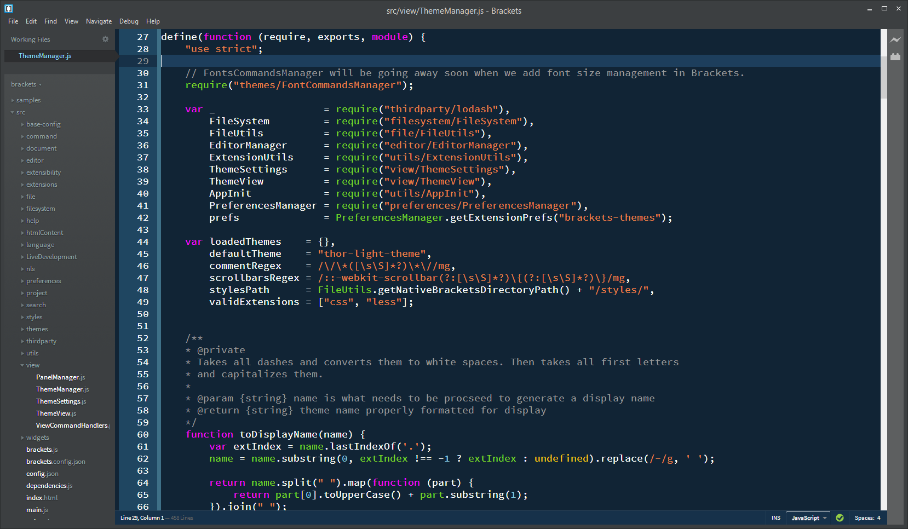

We are aware that Ruby Blue does not currenly work in sprint 42 due to some recent changes a fix will be available shorthly.

Ruby Blue Brackets Theme
==========================

* Ruby Blue is a dark, high contrast theme, that is easy to read.

How to install
==========================

Visit http://brackets-themes.github.io/ to see the latest install instructions.

Troubleshooting
==========================
1. Things look "weird"
	1. Try hitting F5 (Save changes before doing so!).
1. [Open an issue](https://github.com/Brackets-Themes/RubyBlue/issues) if you need personal assistance.

Contributing
==========================
* Please see [`CONTRIBUTING.md`](CONTRIBUTING.md) if you would like to help.

Screenshot
==========================

